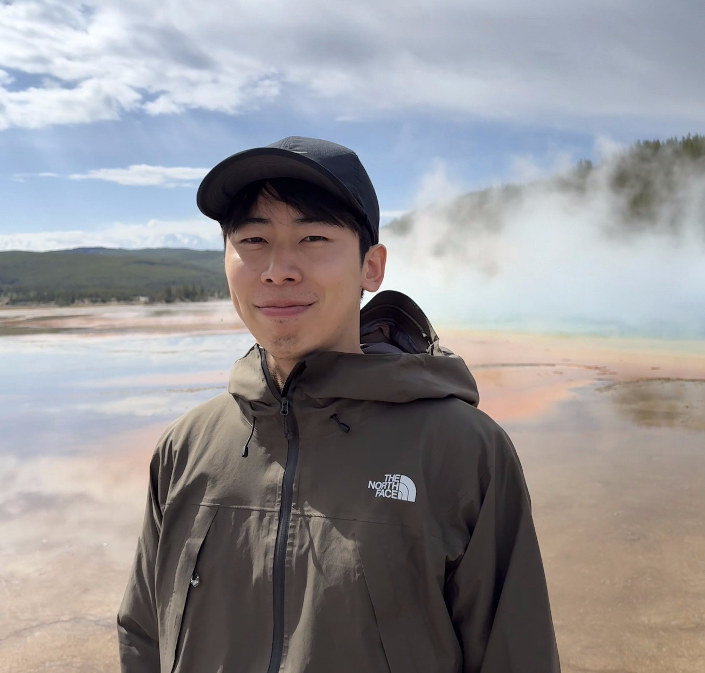

# Riki Otaki

  

    <strong>PhD Candidate, MongoDB PhD Fellow</strong> 
    Computer Science Department, University of Chicago 
    rotaki [at] uchicago [dot] edu 
    John Crerar Library Building, 5730 South Ellis Avenue, Chicago IL 60637
  

  

    
  

---

I am a fourth-year Ph.D. student in Computer Science at the University of Chicago and a [**MongoDB PhD Fellow**](https://www.mongodb.com/company/blog/innovation/announcing-the-2026-mongodb-phd-fellowship-recipients), advised by Prof. [Aaron J. Elmore](https://people.cs.uchicago.edu/~aelmore) in close collaboration with Dr. [Goetz Graefe](https://scholar.google.com/citations?hl=en&user=pdDeRScAAAAJ&view_op=list_works&sortby=pubdate) (Google). I build the next generation of data systems for cloud workloads, advancing memory and compute efficiency through **paged query execution** with fine-grained spills, **fast address translation via address hints** that narrows the disk-vs.-memory gap, and **memory-efficient, skew-resilient sorting**. My research has appeared at VLDB and CIDR.

Prior to my doctoral studies at UChicago, I completed my Bachelor's degree in Aerospace Engineering at the University of Tokyo.

[Google Scholar](https://scholar.google.com/citations?user=tTa7P2MAAAAJ&hl=en) | [LinkedIn](https://linkedin.com/in/riki-otaki-b25a73346) | [GitHub](https://github.com/rotaki)

## News

* **Apr 2026** — Selected as a [MongoDB PhD Fellow](https://www.mongodb.com/company/blog/innovation/announcing-the-2026-mongodb-phd-fellowship-recipients). [[UChicago news]](https://cs.uchicago.edu/news/university-of-chicago-phd-student-riki-otaki-receives-mongodb-phd-fellowship-award/)

## Education

* University of Chicago, Sep 2022 - Present

  PhD in Computer Science, Advisor: Prof. [Aaron Elmore](https://people.cs.uchicago.edu/~aelmore/) | Close Collaborator: Dr. Goetz Graefe (Google)

  Transitional MS Degree was awarded in Mar 2025.

* University of Tokyo, Mar 2017 - Mar 2022

  Bachelor in Aerospace Engineering, Advisor: Prof. [Takehisa Yairi](https://ailab.t.u-tokyo.ac.jp/en/)

* Uppsala University, Aug 2019 - Jun 2020

  Exchange Student

## Publications

### Under review

* **Riki Otaki**, Charles Benello, Fuheng Zhao, Aaron J. Elmore, and Goetz Graefe

  CrocSort: Resource-Efficient, Skew-Resilient Parallel External Merge Sort

### Published

* **Riki Otaki**, Jun Hyuk Chang, Aaron J. Elmore, and Goetz Graefe

  [Enhancing Transaction Processing through Indirection Skipping](https://www.vldb.org/pvldb/vol18/p4104-otaki.pdf)

  Very Large Data Bases (**VLDB**), 2025

* **Riki Otaki**, Jun Hyuk Chang, Charles Benello, Aaron J. Elmore, and Goetz Graefe

  [Resource-Adaptive Query Execution with Paged Memory Management](https://vldb.org/cidrdb/papers/2025/p2-otaki.pdf)

  Conference on Innovative Data Systems Research (**CIDR**), 2025

* Rui Liu, Jun Hyuk Chang, **Riki Otaki**, Zhe Heng Eng, Aaron J. Elmore, Michael J. Franklin, and Sanjay Krishnan

  [Towards Resource-adaptive Query Execution in Cloud Native Databases](https://www.cidrdb.org/cidr2024/papers/p34-liu.pdf)

  Conference on Innovative Data Systems Research (**CIDR**), 2024

## Thesis

* **Bridging In-memory and On-disk Transaction Processing with LIPAH** (Master Thesis, Mar 2025)

## Recent Projects

* **CrocSort: Memory-Efficient, Skew-Resilient Parallel External Sort (2024–2025)**

  Coming soon. (*Under review*)

* **LIPAH: Bridging Disk and In-Memory Transaction Processing (2023–2025)**

  Up to 19.7× speedup on TPC-C-like workloads with 40 threads via combined index and buffer-pool skipping (index alone: 1.3× over BP skipping)—substantially narrowing the disk-vs.-memory throughput gap. **LIPAH** (Logical ID with Physical Address Hinting) is a generalized fast-path skipping technique derived from pointer-swizzling that uses stale hints with cheap validation at lookup, instantiated as index skipping and BP skipping with a concurrent Foster B-Tree as the index target.

* **Query Execution with Paged Memory (2022–2024)**

  A pipelined execution engine where intermediate results live in the buffer pool as paged memory, enabling fine-grained spills, query suspension/resumption, and agile resource reallocation across operators. 15 of 22 TPC-H queries run within 1.5× of the non-paged baseline (slowdowns isolated to LIKE/regex-bound queries). Includes a logical optimizer with correlated-subquery unnesting (O(n²) → O(n)) and filter/projection pushdown.

## Invited Talks

* **Enhancing Transaction Processing through Indirection Skipping** (Nov 2025)

  Microsoft Azure Databases Team Weekly Tech Talk — host: Hanuma Kodavalla

## Experience

* **Software Engineer Intern**, Google — Sunnyvale, CA (Summer 2026)

* **Part-time Engineer**, Preferred Networks — Tokyo, Japan (2022)

  Developed a storage engine from scratch for *Optuna*, a hyperparameter optimization framework, enabling use without access to RDBMS—particularly beneficial on supercomputers. Supported distributed access to the storage via Network File System (NFS), allowing parallel tuning jobs across multiple nodes.

## Teaching

* TA: CMSC 23500/33500 "Introduction to Database Systems" — Winter 2026, Spring 2025, Spring 2024

## Service

* Demo Track Reviewer, VLDB 2026

---

Last updated: April 29, 2026
